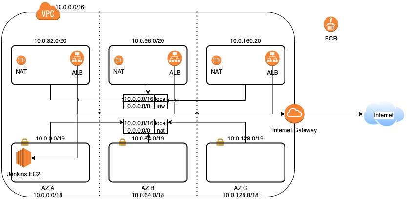

# Infrastructure

Repository holding code to provision all infrastructure components needed, namely
- VPC
- DNS 
- ALB
- ECR
- Jenkins
- Environment (ECS Cluster)


 
### Pre-requisites
 
Before provisioning any code with terraform,
- Update all your files to prevent name-space conflict, 
since all resources will be provisioned in a shared AWS account
```bash
$ ./updateUsername.sh
```
- Configure AWS credentials
- Create a S3 bucket & enable bucket versioning
```bash
$ aws s3 mb s3://REPLACE-USERNAME-bootcamp-2021-tf-state --region us-east-1
$ aws s3api put-bucket-versioning --bucket REPLACE-USERNAME-bootcamp-2021-tf-state --versioning-configuration Status=Enabled --region us-east-1
```
- Create a table in DynamoDB using script
```bash
$ aws dynamodb create-table --table-name REPLACE-USERNAME-bootcamp-2021-tf-lock-table \
    --attribute-definitions AttributeName=LockID,AttributeType=S --key-schema AttributeName=LockID,KeyType=HASH \
    --provisioned-throughput ReadCapacityUnits=5,WriteCapacityUnits=5 --region us-east-1
```

### Provisioning infrastructure (in the mentioned order)

- [VPC](./vpc/README.md)
- [ALB](./alb/README.md)
- [ECR](./ecr/README.md)
- [Jenkins](./jenkins/README.md)
- [Environment on ECS cluster](./ecs-cluster/README.md)

### Destroying infrastructure (in the mentioned order)

- [Environment on ECS cluster](./ecs-cluster/README.md)
- [Jenkins](./jenkins/README.md)
- [ECR](./ecr/README.md)
- [ALB](./alb/README.md)
- [VPC](./vpc/README.md)
