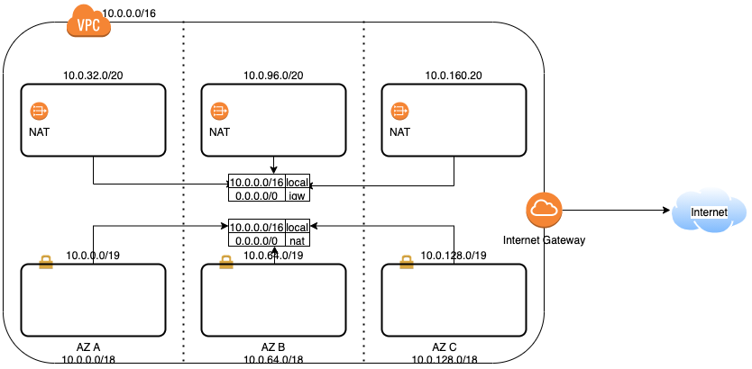

# VPC

The VPC design is based on AWS [blog](https://aws.amazon.com/blogs/startups/practical-vpc-design/) on practical VPC 
design

The entire provisioning of VPC is done using terraform.



### Pre-requisites

- [terraform 0.12.19](https://learn.hashicorp.com/terraform/getting-started/install.html)
- Please replace `FILL_ME` with correct values.

### Steps to provision

```bash
$ terraform init
$ terraform get -update=true
$ terraform plan -out tfplan
$ terraform apply tfplan
```

### Steps to de-provision

```bash
$ terraform init
$ terraform get -update=true
$ terraform plan -destroy -out destroy_tfplan
$ terraform apply destroy_tfplan
```